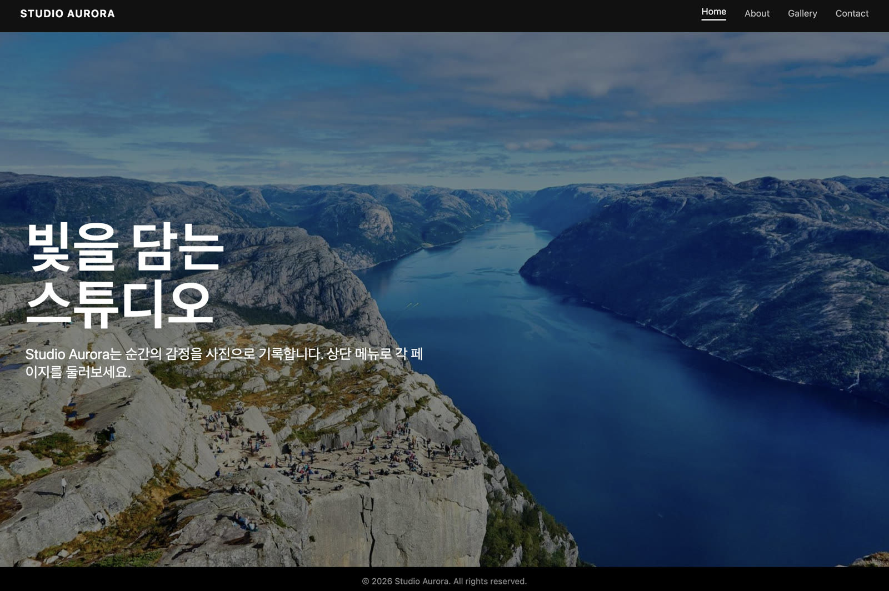
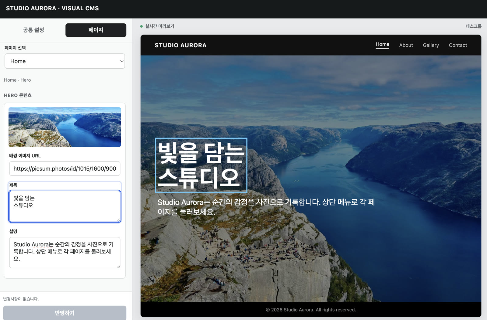
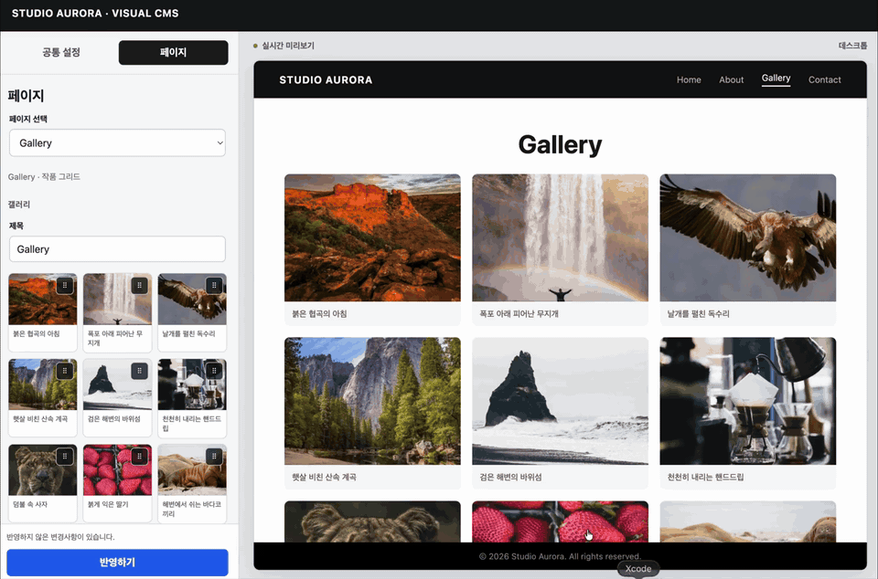

# 🧩 Build Visual CMS

기존 웹사이트를 분석해 **실제 화면과 연결된 맞춤형 CMS**를 설계하고 구현하도록 돕는 Agent Skill입니다.

- 실제 공개 컴포넌트를 미리보기에 재사용
- 편집 필드와 미리보기 요소를 양방향으로 선택·이동
- 편집기와 미리보기의 스크롤을 독립적으로 유지
- 미리보기와 구분되는 밝고 중립적인 편집기 배경
- 텍스트, 이미지와 파비콘·프라이머리 색상·글씨체 공통 설정
- 실제 리스트·그리드·비대칭 배치를 편집기에도 반영
- 왼쪽 편집기 하단의 `반영하기` 버튼 하나로 변경 적용
- **Codex 전용 Agent Skill**

## ✨ 결과 예시

기존 웹사이트의 디자인과 실제 컴포넌트를 유지하면서, 왼쪽에서 콘텐츠를 수정하고 오른쪽에서 결과를 바로 확인하는 CMS로 만듭니다.

| 기존 웹사이트 | Visual CMS |
| --- | --- |
|  |  |

### 🎬 편집 데모



## 🚀 설치

### Codex에 설치

```bash
npx skills add SheepJH/build-visual-cms@build-visual-cms --agent codex --global --yes
```

설치한 뒤 해당 도구를 새로 시작하세요. `--global`을 빼면 현재 프로젝트에만 설치됩니다.

## 🛠️ 사용

작업할 웹 프로젝트를 연 뒤 이렇게 요청하세요.

```text
$build-visual-cms를 사용해서 이 프로젝트를 분석하고,
기존 디자인을 유지하는 시각적 CMS를 구현해줘.
```

구현 전에 설계만 확인할 수도 있습니다.

```text
$build-visual-cms를 사용해서 CMS 도입안을 먼저 작성해줘. 파일은 수정하지 마.
```

## 📌 주요 규칙

<details>
<summary><strong>빠른 실행과 검증 범위</strong></summary>

- 특정 페이지나 기능을 요청하면 해당 범위와 직접 연결된 부분만 조사·구현합니다.
- 범위가 넓으면 대표 페이지 하나에서 구조를 먼저 검증한 뒤 필요한 범위까지만 확장합니다.
- 전체 사이트 구현은 사용자가 모든 페이지를 명시적으로 요청한 경우에만 수행합니다.
- 참고 문서와 검증 항목은 작업에 필요한 부분만 사용합니다.
- 기본 검증은 대표 편집 흐름, 독립 스크롤, `반영하기` 왕복과 범위에 포함된 전역 토큰으로 제한합니다.
- 전체 페이지 스크린샷과 전수 검사는 명시적으로 요청하거나 위험이 큰 전체 작업에서만 수행합니다.

</details>

<details>
<summary><strong>미리보기와 선택 동기화</strong></summary>

- 미리보기는 실제 공개 컴포넌트를 사용합니다.
- 편집 필드를 선택하면 대응하는 미리보기 요소로 이동해 강조합니다.
- 미리보기 요소를 선택하면 정확한 편집 필드를 엽니다.
- 선택한 쪽은 움직이지 않고 반대쪽 영역만 필요한 위치로 이동합니다.
- 편집기와 미리보기는 각각 독립적으로 스크롤합니다.

</details>

<details>
<summary><strong>레이아웃과 편집 환경</strong></summary>

- 실시간 미리보기를 중심에 두고 편집 패널은 필요한 만큼만 사용합니다.
- 왼쪽은 편집기, 오른쪽은 실시간 미리보기로 명확하게 분리합니다.
- 편집기는 미리보기와 섞이지 않는 밝고 중립적이거나 명확히 대비되는 배경을 사용합니다.
- 공개 화면이 리스트이면 리스트, 그리드이면 열·순서·강조·span까지 보존합니다.
- 세로·가로 방향, 그룹, 계층을 편집기에서도 미리보기와 거의 동일하게 알아볼 수 있도록 표현합니다.
- 미리보기 높이가 잘리지 않도록 영역 내부 스크롤로 모든 콘텐츠에 접근하게 합니다.
- 페이지 → 섹션 → 선택 항목 → 필드의 현재 위치와 흐름을 한눈에 알 수 있게 구성합니다.
- 라벨·입력창·이미지 미리보기·도움말·간격은 일관된 규격으로 정리합니다.
- 자주 쓰는 필드는 바로 보여주고 고급·저빈도 설정만 명확한 접기 영역에 둡니다.
- 불필요한 중첩 카드·테두리·장식 아이콘·긴 설명을 줄여 전체 화면을 깔끔하고 직관적으로 유지합니다.

</details>

<details>
<summary><strong>텍스트·이미지·공통 설정</strong></summary>

- 작업 범위에서 운영자가 관리하는 콘텐츠는 유형에 맞는 입력 방식으로 편집하고 실제 미리보기에 반영합니다.
- 링크는 표시 문구와 외부 URL·내부 경로를 각각 수정하고 유효성을 확인할 수 있게 합니다.
- 운영자가 바꿀 수 있는 콘텐츠·배경·반응형 이미지와 로고를 조사해 편집 대상으로 만듭니다.
- 새 CMS나 공통 설정을 만들 때는 파비콘이 없어도 추가·교체 필드를 제공합니다.
- 새 CMS나 공통 설정에는 프라이머리 색상과 글씨체 변경 항목을 제공합니다. 기존 CMS의 부분 수정에서는 관련 없는 공통 설정을 그대로 보존합니다.
- 왼쪽 편집기 상단은 `공통 설정 / 페이지` 두 영역으로 단순하게 구분합니다.
- 공통 설정은 브랜드·스타일·헤더·푸터로 묶고 로고와 여러 페이지에서 공유하는 메뉴 이름·링크·순서를 함께 관리합니다.
- 특정 페이지에서만 사용하는 탭이나 메뉴는 공통 설정이 아니라 해당 페이지에 둡니다.
- 프라이머리 색상을 바꾸면 사이트 전체의 해당 색상 토큰이 일관되게 변경되도록 합니다.
- 글씨체를 바꾸면 사이트 전체의 해당 텍스트에 일관되게 적용하고 실제로 로드되는 안전한 폰트 선택지만 제공합니다.

</details>

<details>
<summary><strong>반복 콘텐츠와 드래그 앤 드롭</strong></summary>

- 전용 손잡이, 삽입 위치 표시, 드래그 미리보기와 취소 기능을 제공합니다.
- 긴 목록에서는 편집기 영역만 자동 스크롤합니다.
- 별도의 위·아래 화살표 버튼은 두지 않습니다.
- 드래그 손잡이에서 키보드 이동을 지원하고 항목 ID로 선택 상태를 유지합니다.

</details>

<details>
<summary><strong>반영하기와 안전한 구현</strong></summary>

- 기존 프레임워크, 디자인 시스템, 인증과 저장 방식을 먼저 재사용합니다.
- 비밀키와 운영 설정을 일반 CMS 필드로 노출하지 않습니다.
- 상단의 초안 저장·발행 버튼과 되돌리기·앞으로 돌리기 버튼은 두지 않습니다.
- 왼쪽 편집기 맨 아래에 `반영하기` 버튼 하나만 두고 진행·완료·실패 상태를 간결하게 표시합니다.
- 승인 없이 배포하거나 운영 데이터를 마이그레이션하지 않습니다.
- 감사나 제안만 요청받으면 파일을 수정하지 않습니다.

</details>

## 📂 구조

```text
skills/build-visual-cms/
├── SKILL.md
├── agents/openai.yaml
└── references/
    ├── cms-architecture.md
    ├── content-discovery.md
    ├── editor-ux.md
    └── validation-checklist.md
```

`SKILL.md`와 `references/`에는 Codex가 작업 중 읽을 지침이 있으며, `agents/openai.yaml`에는 Codex용 표시 정보가 있습니다.

## 📝 커밋 규칙

Conventional Commits 형식과 한국어 설명을 사용합니다.

```text
<type>(<scope>): <한국어 설명>
```

`scope`는 선택 사항입니다. 제목은 한 가지 변경만 간결하게 설명하고 마침표를 붙이지 않습니다.

| 타입 | 용도 |
| --- | --- |
| `feat` | 새로운 규칙이나 기능 추가 |
| `fix` | 잘못된 규칙이나 동작 수정 |
| `docs` | README와 설명 문서 변경 |
| `refactor` | 동작을 바꾸지 않는 구조 정리 |
| `test` | 검증 항목이나 테스트 변경 |
| `perf` | 실행 시간이나 문서 로딩 최적화 |
| `style` | 의미 변화 없는 형식 정리 |
| `build` | 빌드·패키지·의존성 변경 |
| `ci` | GitHub Actions 등 자동화 변경 |
| `chore` | 위 타입에 속하지 않는 유지보수 |
| `revert` | 이전 커밋 되돌리기 |

```text
feat: 편집기와 미리보기의 선택 동기화 추가
fix: 세부 문구가 상위 영역으로 선택되는 문제 수정
docs: Codex 설치 방법 보완
refactor(editor-ux): 중복된 그리드 규칙 정리
test: 썸네일 재정렬 검증 항목 추가
```

호환성을 깨는 변경은 `feat!:` 또는 `feat(scope)!:`로 표시하고 커밋 본문에 영향과 전환 방법을 적습니다.

## 🤝 기여하기

오류 제보와 규칙 개선 제안을 환영합니다.

1. 저장소를 Fork하고 작업 브랜치를 만듭니다.
2. 핵심 불변 조건은 `SKILL.md`, 상세 동작은 `references/`, 사용자 안내는 `README.md`에서 수정합니다.
3. 기존 규칙과 중복되거나 충돌하지 않는지 확인하고 `git diff --check`를 실행합니다.
4. 위 커밋 규칙에 맞춰 한국어 커밋을 작성합니다.
5. Pull Request에 문제 상황, 변경 이유, 검증 방법과 영향을 받은 범위를 적습니다.

큰 방향 변경은 구현 전에 Issue에서 먼저 제안해 주세요. 실제 실패 화면이나 재현 절차가 있으면 함께 첨부하면 검토가 빨라집니다.
